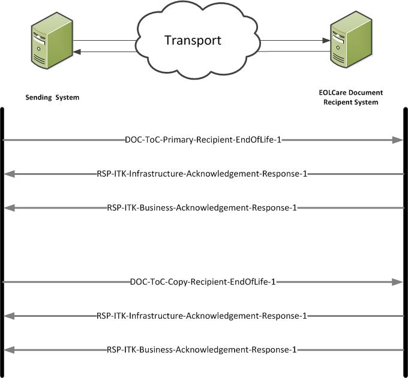

## FHIR Document Architecture ##

The CDA On FHIR England - End of Life Care Document is based on the HL7 [FHIR DSTU2] Document Implementation. 

**CDA On FHIR England - End of Life Care Document Interactions**

This section provides End of Life Care Document implementers with the information required to utilise the End of Life Care Document Domain Message Specification.

All the messages for the End of Life Care Document FHIR interface are based on the [HL7 FHIR DSTU2 1.0.1 Messaging Implementation] (Sept 2015) Messaging Implementation and supports multiple interactions. 

Note 1: When using MESH, additional MESH acknowledgements and responses will be available.The MESH acknowledgements and responses not defined in this specification.

Note 2: Further information regarding the ITK FHIR acknowledgements which may be used with these interactions is available in the ITK FHIR Bundle specification.  

----------

**DOC-ToC-Primary-Recipient-EndOfLife-1 Interaction** 

The sending hospital system will construct an EndOfLife FHIR Document and send it to the primary recipient's receiving system.

- *Sender:* Sending system
- *Receiver:* EndOfLife Recipient system
- *Message: Wire Format:* [EndOfLife-1]

----------

**DOC-ToC-Copy-Recipient-EndOfLife-1 Interaction** 

The sending hospital system will construct an EndOfLife FHIR Document and send it to the copy recipient's receiving system.

- *Sender:* Hospital sending system
- *Receiver:* EndOfLife Recipient system
- *Message: Wire Format:* [EndOfLife-1]

**Acknowledgements Interactions**

Dependant on system set up the following interactions may be utilised.

- RSP-ITK-Infrastructure-Acknowledgement-Response-1
- RSP-ITK-Business-Acknowledgement-Response-1

----------

**End of Life Care Document Interactions Diagram**
 

The diagram shows the End of Life Care Document Document Interactions:

 

  
 

----------

[EndOfLife-1]: ../Profile.EOLDocument/Profile.EOLDocument.html
[FHIR DSTU2]: http://hl7.org/fhir/DSTU2/documents.html

