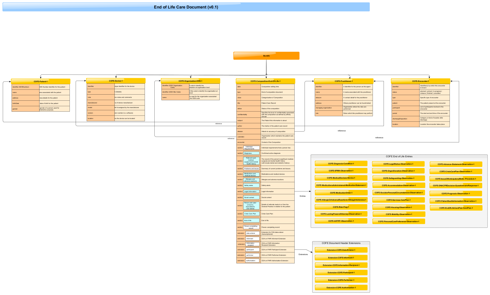

# FHIR Document #

The FHIR resource profiles within this DMS have been created to support the End of Life Care interface:

 - **[End of Life Care - Document]** - FHIR resource profiles combined to support the End of Life Care.

**End of Life Care Document**

A visual representation of the End of Life Care Document is available. The preview image below can be <a href="EOLCompositionHTMLv0.1.png" target="_blank">opened in a new tab</a> or [downloaded as PDF].

  

**Base Resources**

Implementers of the CDA to FHIR Messaging interface are required to support the following optional Base Resource elements (and properties) which are defined for all CDA to FHIR resources within this DMS:

**1. Resource Identity:**

Each resource has an "id" element which contains the logical identity of the resource assigned by the server responsible for storing it.

**2. Resource Metadata:**

Each FHIR resource profile contains an element "meta", of type "Meta", which is a set of metadata that provides technical and workflow context to the resource.
| Metadata Item | Type | Usage | | :---- | :---- | :---- | | profile (0..*) | [uri] | This defines resource profiles that are described in the NRLS FHIR Messages section of the DMS e.g. NHS-Patient [http://hl7.org/fhir/StructureDefinition/Patient] |

**Further Information**

For more information about message profiles visit the [Profiling FHIR] and for resource Metadata visit [Base Resource Definitions].

The various downloads (including Schema files) and reference implementations are available on [FHIR website]. 
 

[End Of Life Care - Document]: ../Profile.EOLDocument/Profile.EOLDocument.html
[{Insert message name}]: ../Profile.{Insert message name}/Profile.{Insert message name}.html
[Profiling FHIR]: http://hl7.org/fhir/DSTU2/profiling.html
[FHIR website]: http://hl7.org/fhir/DSTU2/index.html
[Base Resource Definitions]: http://hl7.org/fhir/DSTU2/resource.html

[downloaded as PDF]:EOLCompositionHTMLv0.1.pdf